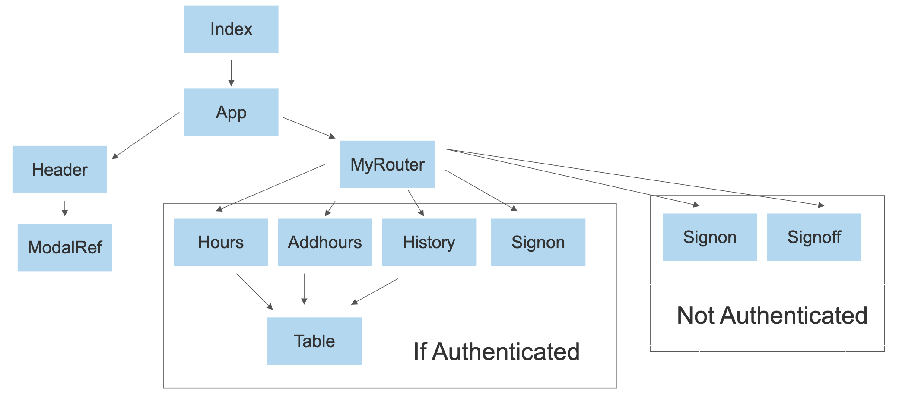

## Welcome to GitHub Home Page

Link to Repository [editor on GitHub](https://github.com/korechia/CompTimeApp/) 

Sand box allows you to edit code a preview output in the same location.

The link to [Code sandbox Editor for main branch](https://codesandbox.io/s/github/korechia/CompTimeApp/?file=/src/App.js)


Link to [Code SandBox Wizard](https://codesandbox.io/s/github). This allows you to enter any github url and begin editing in a web ide.
Code sandbox will update the ui outcome of your code as you are typing.


## Introduction
I used the following libraries and applications to make my app to record comp time for our group:

**Homebrew**-Application to easily download necessary packages to app. (similar to chocolaty on windows). This is used the the command line of the computer.

**React**-React is a javascript library that is used to build User interfaces. Allowing code to be separated into reusable functional components.

**JSX**-Language similar to html. Used in React.

**CSS**- Language for Formating website.

**Firebase**-Used Free Firebase realtime database and authenticator

**Git hub**-Used for Free Version control. This is connected to Heroku for hosting. I used git pages to create a website for easy access to the CompTime app repository.

**Heroku** -Used for Free Hosting 


Each step of the tutorial I will be adding addional functionality to the app untill full functionality is reached.
Here is the order I will present the React and My CompTime App:

0. Basics of how react works             Tutorial part1 Skeleton   (variables,classes, routing basics)
1. Calculate number of hours left.       Tutorial Part2            (read from the database, Firbase setup)
2. Request hours and add hours earned.   Totorial Part3            (Write to the database and use input jsx tags)
4. See history of hours earned and used. Totorial Part4            (Create tables and jsx syntax that can be used)
5. Log in and out.                       Tutorial Part5 Full App   (Authentication of firebase)
6. Show heroku account.                                            (Update branch through terminal. Connected to git)
7. show how apps version control system.                           (create a branch for people to play with in code sandbox)
8. Suggest possible features that could be added                   (Let them work on these features in thier sandbox)


Comp Time App Class Component Map



Whenever you commit to this repository, GitHub Pages will run [Jekyll](https://jekyllrb.com/) to rebuild the pages in your site, from the content in your Markdown files.

### Markdown

Markdown is a lightweight and easy-to-use syntax for styling your writing. It includes conventions for

```markdown
Syntax highlighted code block

# Header 1
## Header 2
### Header 3

- Bulleted
- List

1. Numbered
2. List

**Bold** and _Italic_ and `Code` text

[Link](url) and 
```

For more details see [Basic writing and formatting syntax](https://docs.github.com/en/github/writing-on-github/getting-started-with-writing-and-formatting-on-github/basic-writing-and-formatting-syntax).

### Jekyll Themes

Your Pages site will use the layout and styles from the Jekyll theme you have selected in your [repository settings](https://github.com/korechia/CompTimeApp/settings/pages). The name of this theme is saved in the Jekyll `_config.yml` configuration file.

### Support or Contact

Having trouble with Pages? Check out our [documentation](https://docs.github.com/categories/github-pages-basics/) or [contact support](https://support.github.com/contact) and we’ll help you sort it out.
